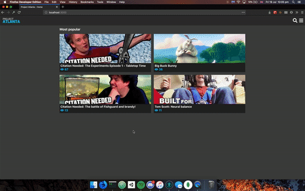

#### React + Node Video Streaming Site

A YouTube-esque clone I wrote to fully experience the job of a Full Stack developer from start to finishing a product.

## It works

It isn't a UI design excercise, you can clone and run the servers and frontend and upload videos. You'll start receiving recommendations and counting views immediately.

## Features

 - S3 based user uploads + streaming
 - Suggestions/Reccomended
 - Views counter
 - Tags
 - Search tags/titles/descriptions from one bar
 - Automatically generates thumbnails with FFMPEG

## The stack

#### Frontend

React, React Router and styled-components

#### Backend

Two node apps, the 'content' server, which hosts the homepage, recommendations and search API, and the scalable uploader server, which can be started any number of times on multiple cloud instances.

##### Content

Node, Express and MongoDB with Mongoose

##### Uploader

Node, Express, FFMPEG, Mongoose and S3 API

#### Cloud stack

This project runs on AWS/DigitalOcean with S3 and EC2, and the DB on MongoDB Atlas

#### Docker

The two servers run in docker containers. You can run multiple uploaders or content servers on the same box with different port maps.

## Acknowledgement

Fair use clip of Tom Scott's [Blindfold Balancing in the Spinning Space Chair](https://www.youtube.com/watch?v=jhQa9xLk5qk) used for example content

## Hey, you!

I'm a college student spends all my free time writing React + Node projects for fun and have experience working on software in a team. If you offer or know anybody offering work or apprenticeship opportunities, please email me with the address listed on my profile.
